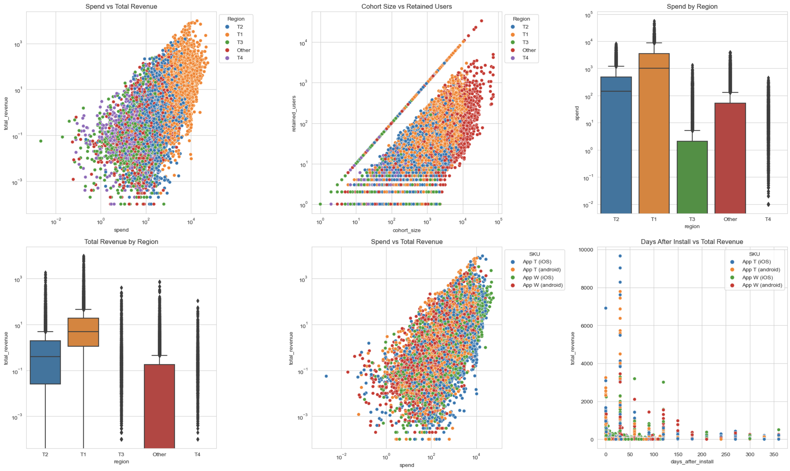
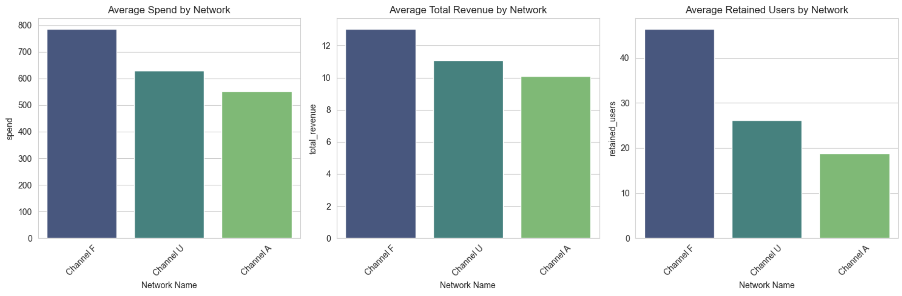
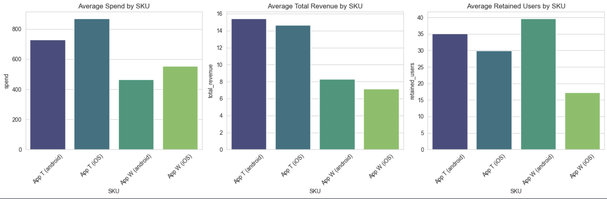
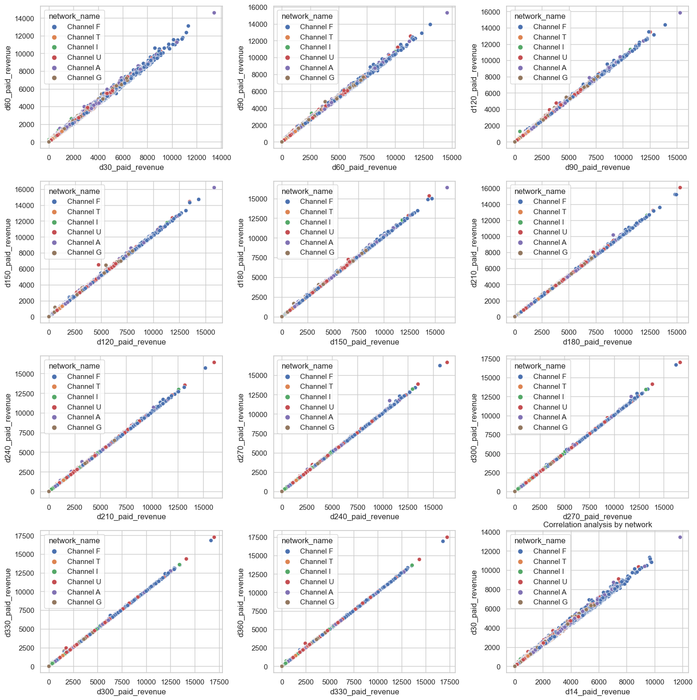
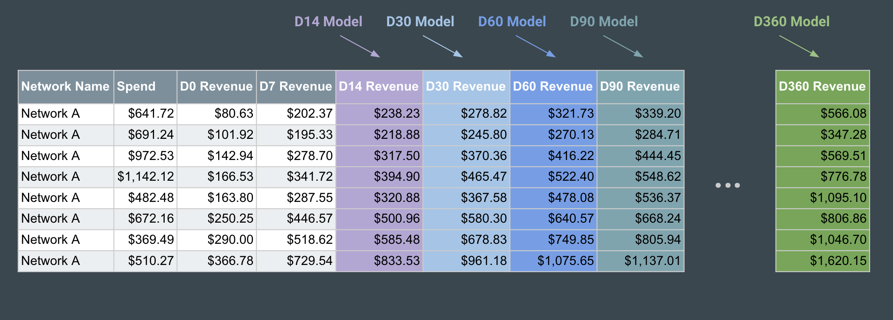
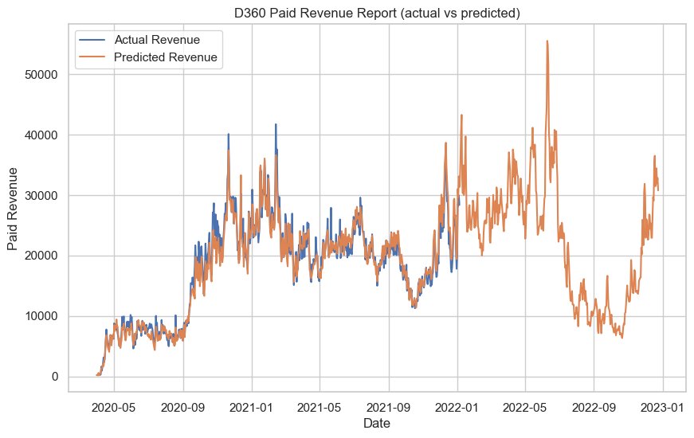
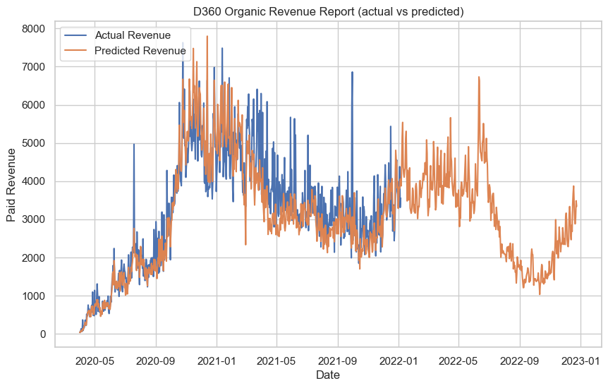
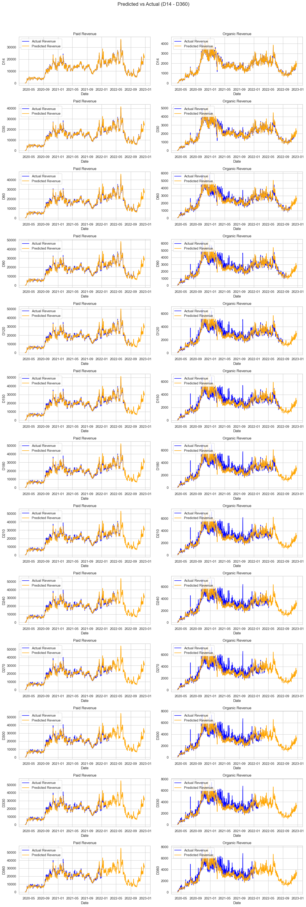

# Mobile Application Marketing

**Context**

In the mobile applications industry, marketing (better known as User Acquisition) is a key component to the success of a product.  In this project, we will be looking at a dataset of the revenue stream generated by the mobile applications. We will be looking at the data from the perspective of a marketing analyst.

**Executive Summary**


<br>

*Disclaimer*: *This is a summary of my analysis, findings, and recommendations. The full analysis can be found [here](prompt.ipynb).*

### Business Understanding

**Business Objective**

The marketing team wants to predict how much revenue will be generated by their new players. If the team can predict the revenue generated by their players, they will be able to optimize their advertising budget to maximize profit. 

Ideally, the Marketing team would like to:

*“Predict future revenue based on the first 7 days of revenue generated by our players”*

Said in a different way (more technical):

*“Given Spend, D0 Revenue, and D7 Revenue predict D14, D30, D60, D90, …, D360 Revenue”*


### Data Problem Definition

We will be using this dataset to build a model that can predict the revenue generated by a player based on the features provided.  We will also be looking at the features that drive the predictions of the model to provide insight to the marketing team.


### Data Description

The dataset contains the following columns:

#### User Acquisition data:

- **date**: The date of the record.
- **sku**: SKU (Stock Keeping Unit) identifier.
- **network_name_hash**: A hashed representation of the network name.
- **region**: Geographical region.
- **days_after_install**: Days passed since the app was installed.
- **period**: Time period (in this case, it appears to be 'day' for all rows).
- **network_name**: Name of the network.
- **spend**: Amount spent.
- **cohort_size**: Size of the cohort.
- **organic_cohort_size**: Size of the organic cohort.
- **retained_users**: Number of users retained.
- **organic_retained_users**: Number of organic users retained.
- **revenue_ad**: Revenue from ads.
- **revenue_iap**: Revenue from in-app purchases.
- **revenue_sub**: Revenue from subscriptions.
- **organic_revenue_ad**: Organic revenue from ads.
- **organic_revenue_iap**: Organic revenue from in-app purchases.
- **organic_revenue_sub**: Organic revenue from subscriptions.

## I. Initial Analysis

#### 1. Is there a relationship between the different features and the revenue generated?



- *Aside from "App W (iOS)" the rest of the apps get very similar spend budgets.*
- *"App W (iOS)" gives pretty good returns since the gap in revenue closed significantly (when comparing vs spend).*
- *The T1 region clearly outperforms the other ones.*



*"Channel F" outperforms the other ones especially when it comes to retained users. That's probably the reason why it gets a bigger spend budget.*



*"App T (android)" comes at the top but its iOS counterpart is quite close - although the android app gets less spend budget. "App W (android)" retains much better than the rest although it doesn't monetize as good as the others.*

This initial analysis didn't generate insights or interesting findings. It was just a way to get familiar with the data and the different features. But I need to interview with subject-matter experts to get a better understanding of how modeling the data could look like.

## II. Feature Engineering

After doing some research and talking to subject-matter experts, I identified that a <a href="https://www.applovin.com/glossary/cohort-analysis/#:~:text=Cohort%20analysis%20lets%20you%20view,or%20the%20chosen%20common%20identifier." target="_blank">cohort analysis</a> could simplify immensely the dataset and increase the predictability of the model by keeping only the features that really matter when analyzing revenue trends in mobile gaming. This means:

- look at aggregated KPIs by date, using the `days_after_install` diimension to create different KPI buckets.
- each bucket helps to understand how user retention affects performance over time (revenue, mainly)
- other dimensions like network, region, sku can be part of the high level aggregation (which is a common practice).

### New Data Structure

Features:

- **date**: the date of the record.
- **network_name**: rhe name of a promotion channel.
- **region**: geographical region.
- **d0_paid_revenue**: revenue generated the day users installed the app on a given date.
- **d7_paid_revenue**: revenue generated in the first `7 days` after users installed the app on a given date.
- **d14_paid_revenue**: revenue generated in the first `14 days` after users installed the app on a given date.
- ...
- **d360_paid_revenue**: revenue generated in the first `360 days` after users installed the app on a given date.

*This new dataset has data only for "App T (android)" since the apps behave differently from each other (individual models for each sku need to be generated). Having said that, all the channels and regions for this specific app will be used for modeling.*


### Analyzing new data structure



*Prior cohort revenue is highly correlated with revenue generated by the current cohort.*

## III. Hypotesis

$\color{green}{Hypothesis}$ 
- D7 revenue can be used to predict D14 revenue.
- D14 revenue can be used to predict D30 revenue.
- D30 revenue can be used to predict D60 revenue ... and so on.

## IV. Predictive Models

#### 1. Model structure

Since we have to predict revenue for different time periods (D14, D30, D60, ..., D360), we will be building a model for each time period. The target variable of the models will be the revenue generated by the cohort in the given time period. These models will be "chained" together (using the output of a model as input of the next one) to predict future revenue all the way to the D360 time period.



#### 2. Data input

Even though each model will be using different revenue features, all will share common feaures. These features will be used to train the model. The features are:
- network_name
- region
- day_of_week
- month
- year

Additionally, the models will be separated into two groups: paid revenue and organic revenue (paid revenue behaves different to organic revenue). This means that we will have a total of 26 models (13 time periods x 2 groups).

Just some of the data will be used to train the model. A portion of the data (30% of the records) was saved for testing purposes to measure the accuracy of the models. 

#### 2. Model design

All models will be Linear Regresion models given the caracteristics of the data and expected results. Details on how these models were optimized can be found [here](prompt.ipynb).

#### 3. Model results

```
models	                scores	    rmses	    maes
d14_paid_revenue	    0.998551	1893.87221	21.209275
d30_paid_revenue	    0.997605	4884.511145	32.110732
d60_paid_revenue	    0.995482	13832.08659	50.728727
d90_paid_revenue	    0.995728	17694.36615	34.006524
d120_paid_revenue	    0.999411	3096.82181	23.59812
d150_paid_revenue	    0.999488	2611.369983	20.562877
d180_paid_revenue	    0.999679	1786.194831	18.078006
d210_paid_revenue	    0.999665	1923.80993	16.601538
d240_paid_revenue	    0.999746	1571.149208	14.540114
d270_paid_revenue	    0.999875    807.817519	12.303678
d300_paid_revenue	    0.99988 806.691484	11.94127
d330_paid_revenue	    0.999901	645.493969	11.105338
d360_paid_revenue	    0.999896	697.595986	11.094529
d14_organic_revenue	    0.997418	113.579519	4.152422
d30_organic_revenue	    0.993758	464.152264	6.465933
d60_organic_revenue	    0.995833	654.189861	9.727285
d90_organic_revenue	    0.998299	336.46789	7.212857
d120_organic_revenue    0.998769	302.532137	6.370774
d150_organic_revenue	0.999383	179.121245	5.031061
d180_organic_revenue	0.999479	172.205857	4.691148
d210_organic_revenue	0.999538	175.617334	4.199346
d240_organic_revenue	0.999729	101.783143	3.656833
d270_organic_revenue	0.999732	109.621167	3.477775
d300_organic_revenue	0.999686	140.360269	3.840332
d330_organic_revenue	0.999785	100.461307	4.030152
d360_organic_revenue	0.99972	    134.55475	4.390776
```


$\color{orange}{Analysis}$

The Linerar Regression models perform exceptionally well. The scores are very close to 1 and the RMSEs and MAEs are very low. This means that the models are very accurate and can be used to predict revenue for different time periods. It's important to mention that these scores are for the test data (data not used during the training process).


## V. Evaluation

### D360 Revenue Prediction

The predictive models were put together (as in the diagram above) to predict from D14 to D360 revenue. The results were then compared to the actual D360 Revenue. The results are shown below:





<br>

$\color{red}{Conclusion}$
The hypothesis is confirmed, early revenue cohorts can be used to predict future revenue. This means that we can use the models to predict future revenue for a given cohort. This is very useful for the business since it can be used to predict future revenue and plan accordingly.

### Cohort Specific Analysis

The models can also be used to analyze each cohort individually. This can be done by analyzing the coeficients of each model. Therore, it's important to analyze each model performance. The results are shown below:



<br>

$\color{red}{Conclusion}$
The "Paid Revenue" predictions are consistently good across the different cohorts. The "Organic Revenue" predictions, however, drop in accuracy around the cohort D60 impacting the D90 - D360 predictions. This is something that needs to be addressed in the future.

## VI. Next Steps & Recommendations

### Recommendations

**Analyze each model coeficients**: The coeficients can give really good insights on how the different channels and regions perform on each specific cohort (D14, D30, D60,etc). This can be used to optimize marketing campaings and evaluate each channel individually. 

**Evaluate each channel using the models**: The models can be used to find a baseline for each channel. This baseline can be used to evaluate the performance of new potential channels. If the new channel performs better than the baseline, then it can be considered a good channel to invest in.

### Next Steps

**Organic Modelings fine-tunning**: Seems like some organic models need more work since they are not as accurate as the paid models affecting the accuracy of the organic D360 revenue inidicator.

**Explore other approaches on organic prediction**: Organic revenue is currently attributed to the different paid channels. This is not ideal since it's not possible to know the real impact of each channel. It would be interesting to treat organic revenue as a separate channel and try to predict it.

**Rollout to other applications**: The models can be used to predict revenue for other applications with similar behaviour. This can be done by using the same models and just changing the input data. For example, the models can be used to predict revenue for a specific region or for a specific network.